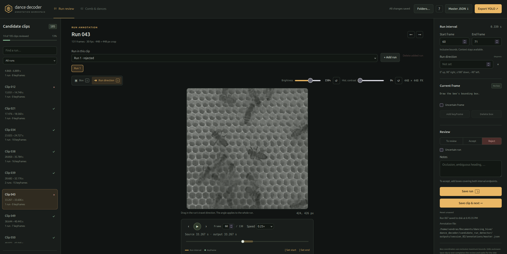
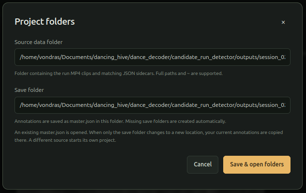

# Waggle dance annotation tool - work in progress

This local browser tool lets you review detector-generated waggle-run clips,
mark the bee with bounding boxes, group accepted runs into dances, and export a
dataset. It works from MP4 clips and their matching JSON sidecars.



## Install and start

From the repository root, create and activate a Python 3.10+ environment, then
install the dependency:

```bash
conda create -n dance-annotation
conda activate dance-annotation
pip install opencv-python
```

Now start the tool:
```bash
python -m annotation_tool
```

Open [http://localhost:8765](http://localhost:8765). The server listens only on
your computer. If it cannot find the default clips folder, choose a source and
save folder in the opening dialog. You can reopen it with **Folders** located in the top bar.



The source folder must contain matching MP4 and JSON clip pairs (see example in [dataset example](guide/example_dataset/)). The resulting annotations are
saved as `annotations/master.json` beside the clips by default; the original
clips and sidecars are never changed.

To set paths when starting the tool:

```bash
python -m annotation_tool \
  --clips-dir path/to/run_clips \
  --annotations path/to/annotations/master.json
```

Edit [config.py](config.py) to change the default clip locations, server port,
image/cache settings, and browser settings. Restart the server after editing it.
Command-line options take precedence over the defaults.

## Annotate a run ([Watch the annotation demo](guide/example_runs.webm))

1. Select a candidate and set its first and last dancing frames with **[** and
   **]**.
2. In box mode, draw boxes around the bee at both ends of the run. Boxes between
   keyframes are interpolated automatically. Redraw an interpolated box to make
   it a correction keyframe.
3. **Delete box** removes the keyframe on the current frame and returns that
   frame to normal interpolation from surrounding keyframes.
4. Set the run direction, uncertainty, and notes, then accept the run or reject
   it as a false detection.

Accepted runs need boxes at both interval endpoints. A clip may contain
several independent runs; use **+ Add run** to create another one. Use **Save
clip & next** to save and continue.

Keyboard controls: **←/→** step a frame, **Shift+←/→** step ten frames,
**Space** play/pause, **B** box mode, **D** direction mode, and **Ctrl/Cmd+S**
save.

## Group runs into dances - Not fully finished

The full-comb view shows accepted runs in original image coordinates. Select
related runs and assign them to a named dance. A run can belong to one dance.

For a comb-image background, provide an undistorted full-resolution image:

```bash
python -m annotation_tool --comb-image path/to/full_comb_undistorted.png
```

Without an image, the tool still works with a coordinate canvas. Automatic
background extraction from a ROS bag is optional and is not needed for normal
clip annotation.

## Export

Export creates a ZIP with cropped images, normalized (YOWO) labels, `classes.txt`,
`manifest.json`, and `master.json`. Class `0` is `waggle_bee`. Only accepted runs
inside their marked intervals are exported. You can include uncertain frames,
export keyframes only, or use a frame stride from the export dialog.

Boxes use crop coordinates in the editor. The master file also stores matching
undistorted full-image coordinates and source/output timestamps.

