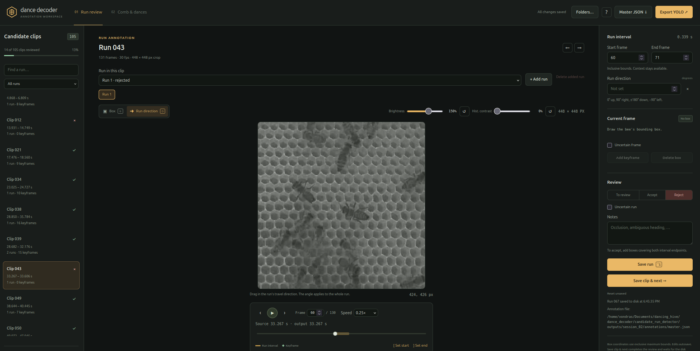
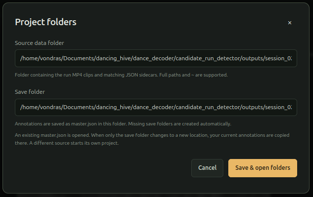

# Waggle dance annotation tool - work in progress

This local browser tool lets you review detector-generated waggle-run clips,
mark the bee with bounding boxes, group accepted runs into dances, and export a
dataset. It works from MP4 clips and their matching JSON sidecars.



## Install and start

From the repository root, create and activate a Python 3.10+ environment, then
install the dependency:

```bash
conda create -n dance-annotation
conda activate dance-annotation
conda install -c conda-forge opencv
```

Now start the tool:
```bash
python -m annotation_tool
```

Open [http://localhost:8765](http://localhost:8765). The server listens only on
your computer. The dataset selected in `config.py` is loaded on startup.
To try the example, set `DEFAULT_DATASET = "example_dataset"`. Click **Folders** in the top bar
to change the source and save folders. If the default clips folder cannot be
found, choose these folders in the opening dialog.



The source folder must contain matching MP4 and JSON clip pairs (see example in [dataset example](guide/example_dataset/)). The resulting annotations are
saved as `annotations/master.json` beside the clips by default; the original
clips and sidecars are never changed.

To set paths when starting the tool:

```bash
python -m annotation_tool \
  --clips-dir path/to/run_clips \
  --annotations path/to/annotations/master.json
```

Edit [config.py](config.py) to change the default clip locations, server port,
image/cache settings, and browser settings. Restart the server after editing it.
Command-line options take precedence over the defaults.

In `config.py`, select `DEFAULT_DATASET` and edit its entry in `DATASETS`:

```python
DEFAULT_DATASET = "prague_2026-09-08T14"
DATASETS = {
    "prague_2026-09-08T14": {
        "clips_dir": REPO / "dance_decoder/yowo_data/prague_2026-09-08T14/run_clips",
        "bbox_size": 64,  # Square side length in clip pixels; tune for this dataset.
    },
    # Add more datasets here.
}
```

Only the selected path is used; an existing folder elsewhere never overrides it.
Folders selected with **Folders** or `--clips-dir` use the size from the matching
`clips_dir` entry, or `DEFAULT_BBOX_SIZE` if unlisted.

For square annotations, edit **Square size** in the **Fixed bounding box** panel beside **Run in this clip** and enable
**Use fixed bbox size** underneath it. Click to place a square centered on the
pointer, or drag inside a box to move it. At image edges the square moves inward
without shrinking. A size larger than the clip is rejected; choose a smaller
size or disable fixed mode. Disabling it restores free drawing and resizing.
Existing boxes change only when you place or move them; changing this setting
does not resize all saved keyframes. Interpolation still uses the saved boxes.

The size and toggle are remembered per source folder in this browser. They do
not rewrite `config.py`; changing the configured size and restarting/refreshing
resets the browser preference to the new size with fixed mode off.

## Annotate a run ([Watch the annotation demo](guide/example_runs.webm))

1. Select a candidate and set its first and last dancing frames with **[** and
   **]**.
2. In box mode, draw boxes around the bee at both ends of the run. Boxes between
   keyframes are interpolated automatically. Redraw an interpolated box to make
   it a correction keyframe.
3. **Delete box** removes the keyframe on the current frame and returns that
   frame to normal interpolation from surrounding keyframes.
4. Set the run direction, uncertainty, and notes, then accept the run or reject
   it as a false detection.

Accepted runs normally need boxes at both interval endpoints. If a run cannot
be annotated reliably, check **Uncertain run**: direction and endpoint boxes
are optional, and **Accept** or **Save clip & next** completes the review with
whatever annotations are available. This exception applies to the whole-run
checkbox, not **Uncertain frame**. Unchecking it restores the normal requirements.
Uncertain runs are excluded from exports by default; explicitly including them
exports only available keyframes/interpolation, never missing or held boxes.

A clip may contain
several independent runs; use **+ Add run** to create another one. Use **Save
clip & next** to save and continue.

Keyboard controls: **←/→** step a frame, **Shift+←/→** step ten frames,
**Space** play/pause, **B** box mode, **D** direction mode, and **Ctrl/Cmd+S**
save.

## Group runs into dances - Not fully finished

The full-comb view shows accepted runs in original image coordinates. Select
related runs and assign them to a named dance. A run can belong to one dance.

For a comb-image background, provide an undistorted full-resolution image:

```bash
python -m annotation_tool --comb-image path/to/full_comb_undistorted.png
```

Without an image, the tool still works with a coordinate canvas. Automatic
background extraction from a ROS bag is optional and is not needed for normal
clip annotation.

## Export

Export creates a ZIP with cropped images, normalized (YOWO) labels, `classes.txt`,
`manifest.json`, and `master.json`. Class `0` is `waggle_bee`. Only accepted runs
inside their marked intervals are exported. You can include uncertain frames,
export keyframes only, or use a frame stride from the export dialog.

Boxes use crop coordinates in the editor. The master file also stores matching
undistorted full-image coordinates and source/output timestamps.

## Tests

Regression tests live in `tests/`. Run them from the parent directory containing
`annotation_tool` (Python tests require OpenCV and NumPy; JavaScript tests require Node.js):

```bash
python -m unittest discover -s annotation_tool/tests -t .
node annotation_tool/tests/test_box_deletion.js
node annotation_tool/tests/test_fixed_bbox.js
node annotation_tool/tests/test_uncertain_run.js
```
